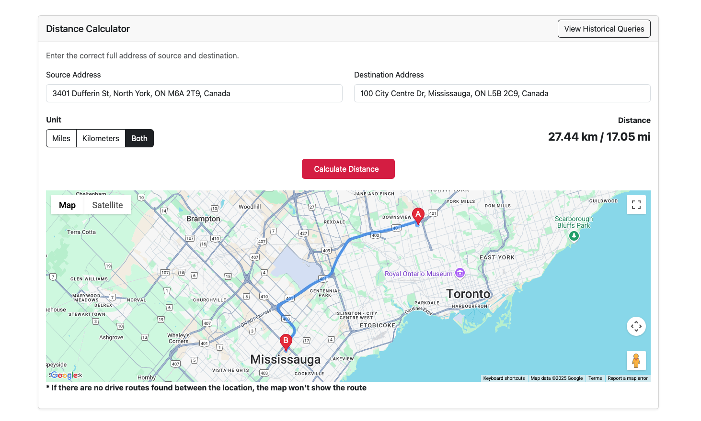

# Address Mapper

## Overview
Address-Mapper is a **full-stack web application** built with **SvelteKit (Frontend)**, **Node.js + Express (Backend)**, and **MongoDB (Database)**. It calculates the distance between addresses and provides a user-friendly interface.
This project supports **Docker deployment**, making it easy to set up locally and in production.



## Getting Started

> Pre-requisite: Docker client should be running, envs should be added ( this will just make sure the third party apis are working )

1. Clone the repo

2. Add environment variables in /backend before running the project, create a `.env` file inside the `backend` folder and add the following variables:

```bash
  PORT=7004
  MONGO_USERNAME= # MongoDB user name
  MONGO_PASSWORD= # MongoDB password
  MONGO_HOST= # MongoDB host
  GOOGLE_API_KEY= # Google API key
  ALLOWED_ORIGINS= # http://localhost:5173 for local development and testing
```

3. Update variable `API_URL` and set it to localhost url [web/src/config/constant.js](./web/src/config/constant.js)
```bash
   localHost url: http://localhost:7004
```
4. On project root terminal run 
```bash
  make service
```

## Hosting & Deployment
The project is live and accessible at https://address-mapper-production-322e.up.railway.app.

The application is deployed using **Railway**, and **Docker** is used for containerization, ensuring reliable deployment environments

## API Documentation
You can access swagger api-documentation at https://address-mapper-production.up.railway.app/api-docs/#/

Make sure to change the server to production server while using the api-doc. 

## Tech Stack & Features

| Category          | Technologies |
|------------------|-------------------------------|
| **Frontend**     | SvelteKit, Vite, Bootstrap |
| **Backend**      | Node.js, Express.js |
| **Database**     | MongoDB |
| **Deployment**   | Docker, Docker Compose, Railway |
| **Linting**      | ESLint, Prettier |
| **APIs**        | Nominatim (Geocoding), Google API (Distance Calculation) |


### Frontend
- Built with **SvelteKit** and **Vite** for modern UI development
- Uses **Bootstrap** for responsive design and styling

### Backend
- Secure and scalable **Node.js & Express.js** architecture
- **Joi Middleware** for request validation and data integrity
- API documentation with **Swagger**
- **Retry Mechanism** to handle API failures gracefully
- **Rate limiting, CORS, Helmet, and Joi validation** for security and performance
- Proper test cases with **node:test**

### Database
- **MongoDB** for flexible document-based storage

### Third-Party Integrations
- **Nominatim API** for address-to-coordinates conversion
- **Google API** for accurate distance calculations

### Security & Performance
- **Rate Limiting** to prevent abuse and throttling
- **CORS Enabled** to handle cross-origin requests securely
- **ESLint & Prettier** for code quality and formatting

### Deployment & DevOps
- **Dockerized Backend & Web** using **Docker Compose** for easy deployment
- **Railway** for cloud hosting with auto-deployments
- **Makefile** to consolidate commands


## More commands 

```bash
  make lint-backend
```
Lint and Format the Backend Code.
Fixes ESLint errors in the backend code (backend/**/*.js).
Formats code using Prettier for consistent styling.

```bash
  make start-backend
```
Starts the Backend. Navigates to the backend directory and starts the Node.js Express server.
Runs on port 7004 by default.

```bash
  make start-web
```
Start the Frontend. Navigates to the web directory and starts the SvelteKit frontend.
Runs the frontend on port 5173 by default.

```bash
  make service
```
Start the Full Application with Docker. Runs the entire application using Docker Compose.

```bash
  make service-build
```
Builds all Docker containers without starting them. Useful if you want to prepare images before deployment.

```bash
  make service-stop
```
Stops all running Docker containers gracefully.

```bash
  make test
```
Start running the backed test cases.

